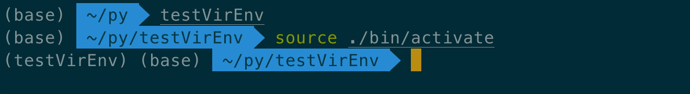

:::tip
在可移植性的要求下，局部安装>全局安装
:::

<!--more-->
## 理论

### 创建虚拟环境(unix)

+ venv(python >= 3.3)

```sh
python3 -m venv <DIR>
source <DIR>/bin/activate
```

+ virtualenv(需要独立安装)

```sh
virtualenv <DIR>
source <DIR>/bin/activate
```

:::tip

使用unix shell的source是为了虚拟环境的变量加入到当前的shell，而不是子进程中

:::

### 创建虚拟环境(window)

+ 由于window下不能使用source命令，所以直接执行activate脚本, 当前调用venv或者virtualenv初始化目录的步骤还是存在的，区别是下面的

```sh
<DIR>\Scripts\activate
```

+ 下面是使用PyCharm，可以看到：它默认创建了venv方式的虚拟环境


## 实践

+ 执行 python -m venv ./testVirEnv之后，目录初始化的内容


+ 执行source DIR/bin/activate之后命令行变化


:::tip
可以看到，创建虚拟环境的方法就是，先初始化环境目录，再将当前执行安装命令的目的路径指过去
:::

+ python三方库安装的位置

```sh
lib/python[版本号]/site--packages
```

类比node，只是这个目录更加隐蔽，而node就是package.json同级目录的node_modules

